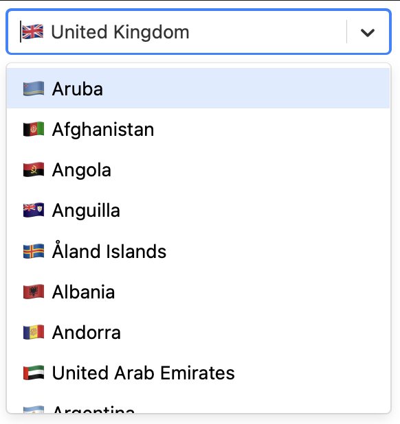

# Geo Country Select

Geo Country Select gives you a [react-select](https://react-select.com) dropdown of countries with the user's location pre-selected based on geo IP.

Powered by Cloudflare Workers and KV store!

## Demo

Codesandbox demo: https://codesandbox.io/s/geo-country-select-g6byi?file=/src/App.js

## How it works

1. We use react-select (but you could use any lib, or even just html) to render dropdown.
2. List of all countries is fetched from our Worker at /countries
3. Worker gets the country list in JSON from the KV store
4. Country code of the user's location is fetched from the internal Cloudflare request.cf.country object.
5. List of all contries, plus the user's country is then returned and rendered by react-select.
